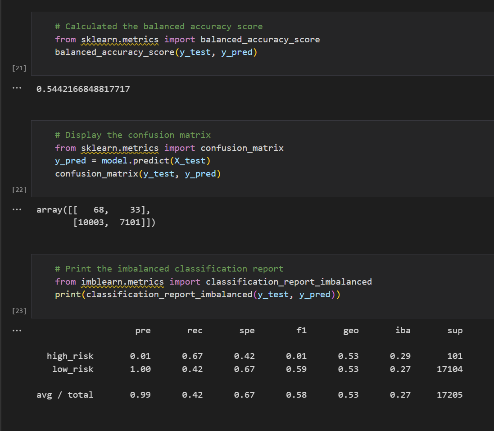
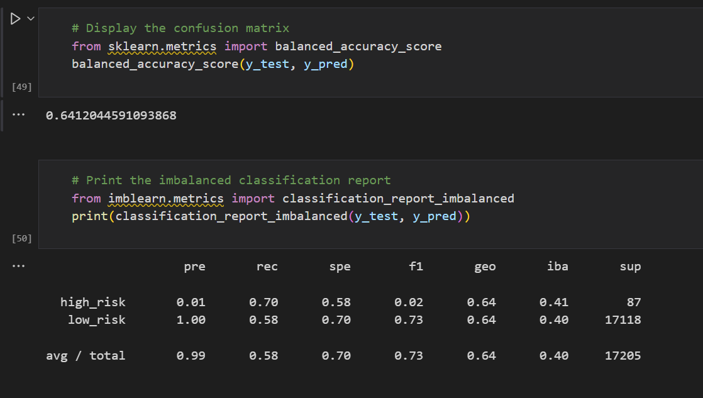

# Credit_Risk_Analysis
## Project Pverview
Using Python to build and evaluate several machine learning models to predict credit risk. Being able to predict credit risk with machine learning algorithms can help banks and financial institutions predict anomalies, reduce risk cases, monitor portfolios, and provide recommendations on what to do in cases of fraud.

## Results
1. Naive Random Oversampling

Here it can be noted that the balancd accuracy score is approximately 65%. This means that the model predicted the credit risk accurately 65% times. Althogh its a good score, it is not excellent. The high risk precision is about 1% only with 61% sensitivity. Due to the high number of low_risk population, its precision is almost 100% with a sensitivity of 69%. This shows that the precision scores for this type of model are greatly skewed towards the low risk loans. The low risk loans were predicted accurately however the high risk loans were not.Hence this model is not a good choice for identifying the high risk loans.

2. Smote Oversampling

It can be noted that the balanced accuracy score for this model is 65%. There is not much difference between this model and the previous model. Although the score is good, it is not excellent. The high risk precision is about 1% with 64% sensitivity. This model is not a good choice for trying to identify high risk loans just like the previous model.

3. Undersampling

Here the balanced accuracy score is 54%. The high risk precision here is still 1% with 67% sensitivity. The low risk precision is still more accurate at 100% with sensitivity of 42%. This may be because of high number of false positives.
Hence, this cannot be used as a great model for our predictions.

4. Over and Under Sampling(SMOTEENN)

The balanced accuracy score is 64%. The high risk precision is still 1% with only 70% sensitivity. Herer too due to high number of false positives, the low risk sensitivity is 58%. Compared to the previous models, this model is a little better but still not the best option.

5. BalancedRandomForestClassifier

The balanced accuracy matrix is approximately 79%. This shows a lot of imprvement as compared to the previous models. The high risk precision is still low at 4% but a little more than the other ones that we have seen so far. The sensitivity for high risk precision is 67%. Here the value of F1 is also 7%. Since there are lower false positives, the low risk sensitivity is 91% with a precision of 100%.

6. EasyEnsembleClassifier

For this model the balanced accuracy score is 92.5% with a sensitivity of 91% and the F1 value is 14%. Here due to the low number of false positives, the low risk sensitivity is 94% with a precision of 100%. This shows that there was a high rate of true positives in this model.

## Summary
The Easy Ensemble AdaBoost Classifier is a model that has brought a lot of improvement over other models, especially in terms of its sensitivity to high-risk credits. However, there are still some imperfections in the model that need to be addressed. In addition, more training and testing will be needed to get a clear reading on credit risk. For these reasons, I suggest that the bank not use any of the models mentioned to make predictions about credit risk.
